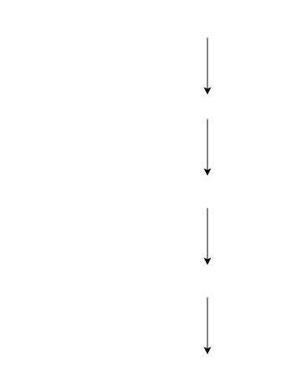

IoTDB的数据建模以物联网模型为基础，非常贴合工业生产场景。理解IoTDB的数据模式，才能更佳地使用IoTDB。

# 基本概念

## 测试数据含义

测试数据为能在IoTDB中使用，表头已修改为如下样式，即“Time”和“root.BHSFG.Q1.W002.WROT_HubTmp”字段。

| Time                          | root.BHSFC.Q1.W002.WROT_HubTmp |
| ----------------------------- | ------------------------------ |
| 2022-01-11T05:51:40.000-08:00 | 14.4                           |
| 2022-01-11T05:51:54.000-08:00 | 14.5                           |
| 2022-01-11T05:52:01.000-08:00 | 14.4                           |

字段含义：电力集团BHSFC，拥有Q1风电厂，风电厂有一座名为W002的风机，风机上测量的数据即轮毂温度命名为WROT_HubTmp。

IoTDB 采用树形结构定义数据模式，根节点默认为 root，节点之间用 . 分割。测试数据的时间序列在IoTDB中命名为“root.BHSFC.Q1.W002.WROT_HubTmp”。

## 时间戳、测点、时间序列

### 时间戳

时间戳(Timestamp)：一个数据到来的时间点

### 测点、时间序列

在IoTDB中，测点即时间序列。工业场景中，一个传感器或元件采样一个物理量。如果一个测点在不断地采集数据，每个数据点会打上一个时间戳，这个测点的数据就是一条时间序列，一条时间序列举例如下：

IoTDB以从 root节点到叶子节点的路径来命名一个时间序列，如测试数据的存储名字“root.BHSFG.Q1.W002.WROT_HubTmp”即是时间序列名，也是测点名。

## 元数据建模

### 物联网数据模型

将物联网数据模型表示为如下图所示的属性层级组织结构，即电力集团层-工厂层-设备层-测点层。设备，例如可以是测试数据中的二号风机。测点，例如可以是风机上的传感器，温度传感器，风速传感器等。

风机测量的温度加上时间戳即是一条时间序列，IoTDB 的目标场景就是管理很多这种时间序列。

### IoTDB数据模型

root为根节点，IoTDB中的时间序列开头必须以此开头。第二层及以下可以设置为存储组（Storage group）。倒数第二层是实体，实体不需要创建。倒数第一层是物理量，即时间序列。

上图的红色字样即为IoTDB的建模内容，存储组的建模根据需要可设置多个层级，至少为2层，图中的存储组1为4层，存储组2为3层。